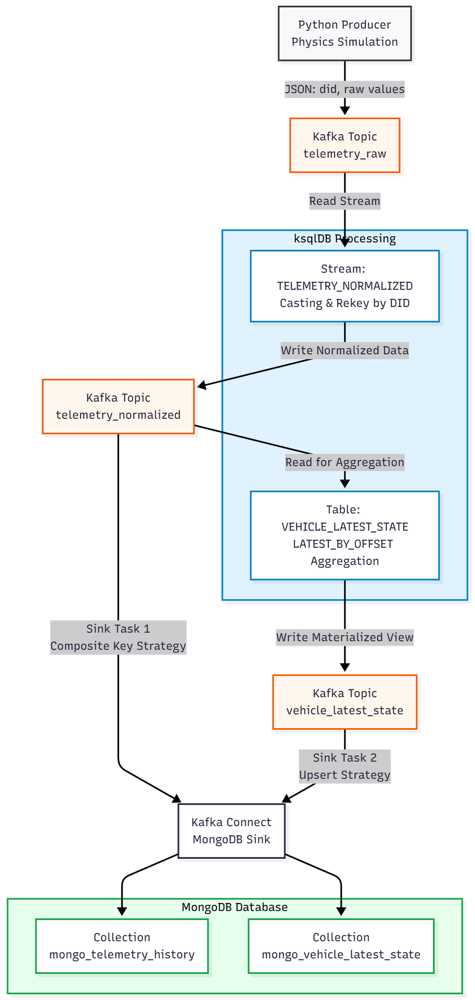

# Project: Real-Time Telemetry Streaming Pipeline

## 1\. Context & Problem Statement

For this exercise, I was given two use case files containing sample telematics data. The data represents how a real EV TCU sends signals like speed, odometer, SoC, and ignition status. Each of these values comes as an independent event, at different timestamps, instead of one combined snapshot.

The requirement was to take this kind of fragmented input and turn it into two usable outputs:

1.  **A raw event history**, stored exactly as it is received.
    
2.  **A real-time “vehicle state” document** that always reflects the latest values for each signal.
    

The first file shows a simple set of four events and the expected outputs from two consumers. One consumer stores the raw events with ingestion timestamps. The other consumer stores a single merged state with the latest odo, soc, speed and ignition. The second file extends this idea with more events across multiple timestamps, and the final MongoDB output again shows only the most recent combined state for that vehicle.

So the ask here is to take fragmented input and produce both: an immutable history and an always-updating, consolidated view. The main problem is that TCUs optimise for bandwidth and send signals independently, while downstream systems need a clean, unified picture of the vehicle at any moment. The task is to build a simple streaming pipeline that can stitch these scattered events together and materialize the latest known state.

## 2\. System Architecture

A tightly integrated real-time stack:

•             **Apache Kafka** for ingestion and log persistence

•             **ksqlDB** for real-time parsing and state aggregation

•             **Kafka Connect** for data movement

•             **MongoDB** as both the audit store and the state store

•             **Python** for orchestration, automation, and data generation

•             **Docker** as the execution environment

## 3\. Implementation Details

### 3.1 Data Generation

The usual load-testing tools (like Datagen) weren’t enough here because they only produce random values. That doesn’t help when the goal is to test “latest state” logic, where the sequence and behaviour of signals actually matter. To validate the pipeline properly, I needed data that behaved somewhat like a real vehicle.

So I wrote a small custom producer `producer.py` that keeps an internal `DeviceState` object. It simulates a few basic physical behaviours:

- **Inertia:** Speed doesn’t jump from 10 to 80 instantly. It gradually increases or decreases over time.
    
- **Battery behaviour:** The SoC drops slowly, depending on speed and whether the ignition is on.
    
- **Fragmented emissions:** The producer only sends one metric at a time for each tick, chosen at random. This mirrors how TCUs send signals independently rather than as a combined packet.
    

This setup gave me realistic, sequential data and allowed me to verify that the “**latest state**” calculation was working correctly.

### 3.2 Flow Diagram



### 3.3 Stream Processing

The main logic sits in ksqlDB, using a simple Stream-to-Table pattern to rebuild the latest vehicle state from the fragmented events.

**Step 1: Normalization**  
The raw Kafka messages come in with mixed types, so I first created a `TELEMETRY_NORMALIZED` stream. This casts the values into proper numeric types and also re-partitions the data.

- A key design choice here was to explicitly `PARTITION BY "did"`. This makes sure that all events for a given vehicle end up on the same partition, which keeps the ordering intact. Without that, the state updates can become inconsistent.

**Step 2: Aggregation**  
To build the real-time state, I used a ksqlDB table as a materialized view. This avoids external caches and still gives fast lookups.

```sql
CREATE TABLE VEHICLE_LATEST_STATE AS
SELECT
  did,
  LATEST_BY_OFFSET(CASE WHEN sensor_name='odometer' THEN float_value END) AS odo,
  LATEST_BY_OFFSET(CASE WHEN sensor_name='soc' THEN int_value END) AS soc,
  ...
FROM TELEMETRY_NORMALIZED
GROUP BY did;
```

- The idea is straightforward. Whenever a new event arrives, only the corresponding column is updated. For example, if a speed event comes in, only `speed` changes, while `odo` and `soc` keep their previous values. Over time, this table becomes the live, combined state of the vehicle.

### 3.4 Storage & Write Strategies

For MongoDB, the pipeline needed to support two different behaviours. One collection had to store every event exactly as it arrived, and the other had to always show the latest state. To keep things clean, I used two separate Kafka Connect sink configurations.

**Use Case A: Immutable History**

- The first requirement was to store a full event history. Nothing should ever be overwritten, and duplicate messages from Kafka should not create multiple copies.
    
- To handle this, I used `ReplaceOneBusinessKeyStrategy` with a composite key made of `did`, `sensor_name` and `timestamp`. This combination uniquely identifies an event. If Kafka retries a message, MongoDB simply matches it using the same key and updates the existing record, so the collection remains free of duplicates.
    
- *Requirement:* Never overwrite data. Idempotency is key.
    

**Use Case B: Latest Vehicle State**

- The second requirement was the opposite. Here, we only care about the most recent state of the vehicle, and we always want to overwrite the document.
    
- For this, I used `ReplaceOneDefaultStrategy` along with `PartialValueStrategy` and enabled upserts.
    
- *Requirement:* Always overwrite.
    
- *Config Code:*
    
    ```json
    "writemodel.strategy": "com.mongodb.kafka.connect.sink.writemodel.strategy.ReplaceOneDefaultStrategy",
    "replace.one.strategy.filter": "{\"did\": \"${value.did}\"}",
    "replace.one.strategy.upsert": "true"
    ```
    
- This tells Kafka Connect to update the document for that `did` if it already exists, or create a new one if it doesn’t. As a result, the collection only contains one record per vehicle, and it always reflects the latest combined state.
    

## 4\. Orchestration & Stability Guardrails

Docker-based Kafka setups often run into timing issues during startup. Services come up in the wrong order, and then ksqlDB starts querying topics that don’t exist yet, or Kafka Connect tries to write to MongoDB before it is ready.

To avoid these problems, I added a small Python orchestration layer (`main.py`) instead of relying only on `depends_on`.

1.  **Controlled Topic Creation**  
    In the Docker settings, I disabled Kafka’s auto topic creation (`KAFKA_AUTO_CREATE_TOPICS_ENABLE: "false"`). All topics are created ahead of time through `kafka_utils.py`, with the correct partitions and retention settings. This keeps the environment consistent every time it starts.
    
2.  **Wait-for-Data Check**  
    I added a simple `wait_for_data()` function in `orchestrator.py`. The idea is to hold off on registering the Kafka Connect sinks until the producer has actually pushed some data into the topics. This prevents the usual “table not found” or “stream contains no rows” errors that often show up during automated builds or restarts.
    

## 5\. Deployment Runbook

This runbook outlines the operational procedures for the telemetry streaming pipeline (Kafka → ksqlDB → Kafka Connect → MongoDB). The system is containerized via Docker and orchestrated by a Python entrypoint script.

### 1\. Start the Infrastructure

The stack includes Kafka, Schema Registry, Connect, ksqlDB, and MongoDB.

```bash
docker compose up -d
```

> **Note:** The first startup may take several minutes as Docker pulls the images.

### 2\. Pipeline Orchestration

Once containers are healthy, use the `python -m pipeline.main` command to initialize the logic.

### Standard Startup

```bash
python -m pipeline.main
```

**This automates:**

- Infrastructure health checks
- Topic creation (with correct partitioning)
- ksqlDB migrations (Streams & Tables)
- Producer startup (Physics simulation)
- Kafka Connect sink registration

### Execution Modes

The orchestrator supports specific flags for development and demonstrations.

| Mode | Command | Description |
| :--- | :--- | :--- |
| **Replace Mode** | `telemetry_pipeline --replace` | Forces re-registration of Kafka Connect sinks. Use this when you have modified connector JSON configs. |
| **Demo Mode** | `telemetry_pipeline --demo-mode` | **Recommended for Interviews.** Pauses execution at each major step, allowing you to explain the architecture before proceeding. |

### 3\. Developer Toolbox

These commands are essential for debugging specific components of the stack without restarting the entire pipeline.

### 3.1 Kafka Debugging

**Consume from a topic (Read-only)**  
Inspect raw or normalized data flowing through the broker.

```bash
docker run --rm -it --network host confluentinc/cp-kafka:7.4.1 \
  kafka-console-consumer \
    --bootstrap-server localhost:29092 \
    --topic telemetry_raw \
    --from-beginning --max-messages 10
```

*Common Topics:* `telemetry_raw`, `telemetry_normalized`, `vehicle_latest_state`

**Manually Produce a Message**  
Inject a specific payload to test edge cases.

```bash
kafka-console-producer --bootstrap-server localhost:29092 --topic telemetry_raw
```

*Paste payload:*

```json
{"did":"1000", "timestamp":1690000000000, "name":"odometer", "float_value":123.45}
```

### 3.2 ksqlDB Debugging

**Access the CLI**

```bash
docker exec -it conf-kakfa-mongodb-stk-ksqldb-server-1 ksql
```

**Common Queries**

```sql
-- Check the "Digital Twin" state for a specific device
SELECT * FROM VEHICLE_LATEST_STATE WHERE DID='981';

-- Inspect the live normalized stream
SELECT * FROM TELEMETRY_NORMALIZED EMIT CHANGES LIMIT 10;

-- Inspect Schema/Topology
DESCRIBE EXTENDED TELEMETRY_RAW;
DESCRIBE EXTENDED VEHICLE_LATEST_STATE;
```

### 3.3 MongoDB Debugging

**Check History (Audit Trail)**

```bash
docker exec -it conf-kakfa-mongodb-stk-mongodb-1 \
  mongosh --eval \
  "db.getSiblingDB('telemetry_db').mongo_telemetry_history.find().limit(3).pretty()"
```

**Check Latest State (Digital Twin)**

```bash
docker exec -it conf-kakfa-mongodb-stk-mongodb-1 \
  mongosh --eval \
  "db.getSiblingDB('telemetry_db').mongo_vehicle_latest_state.find().limit(3).pretty()"
```

### 3.4 Docker Operations

**Rebuild and Restart**

```bash
# Standard rebuild (uses cache)
docker compose build
docker compose up -d

# Clean rebuild (forces fresh install of dependencies)
docker compose build --no-cache
docker compose up -d
```

**Restart a Single Service (e.g., ksqlDB)**

```bash
docker compose stop ksqldb-server
docker compose rm -f ksqldb-server
docker compose up -d ksqldb-server
```

### 3.5 Python Development

If you need to run the python logic directly without the console script alias:

```bash
# Standard run
python -m pipeline.main

# With flags
python -m pipeline.main --demo-mode
```

**Reinstall Package**  
If the console script behaves unexpectedly, force a reinstall:

```bash
pip install --upgrade --force-reinstall -e .
```

* * *

## 4\. Best Practices & Notes

- **Development:** Always use editable installs (`pip install -e .`). This ensures changes in your IDE are immediately reflected in the CLI tool.
- **Git:** Do not push build artifacts (like `*.egg-info/`) to the repository.
- **Caching:** When changing Dockerfile logic, always use `docker compose build --no-cache` to ensure changes are picked up.
- **Demos:** The orchestrator handles the complex sequencing of distributed systems. Always use `--demo-mode` during live presentations to ensure a smooth flow.

## 6\. Final Results

The pipeline successfully converts disjointed input streams into a unified state document.

**Input (Fragmented):**  
`{ "did": "1001", "name": "speed", "value": 45 }` ... (200ms later) ... `{ "did": "1001", "name": "soc", "value": 88 }`

**Output (Unified in MongoDB):**

```json
{
    _id: { did: '1000' },
    ingestion_time: '2025-11-23T16:07:23.151Z',
    soc: Long('98'),
    eventTime: '2025-11-23T16:07:23.151000+00:00',
    odo: 188.52,
    ignition: Long('1'),
    did: '1000',
    speed: Long('53')
    }
```